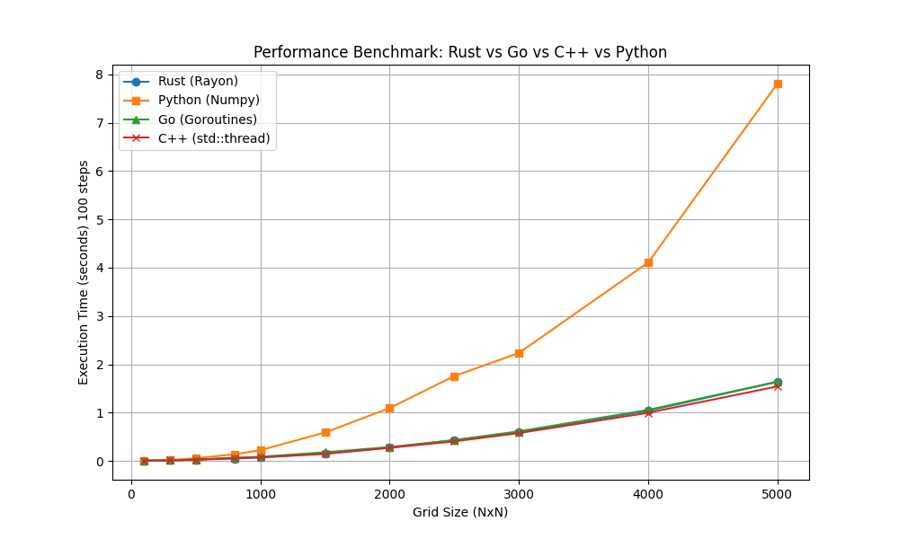

# Comparative Analysis of Modeling Environments
## Fire Propagation Simulation using Cellular Automata

This project implements a simulation of fire propagation in a forest using Cellular Automata rules. The primary objective is to compare the performance, scalability, and development experience across three different programming languages and environments:

- **Rust**: High performance with safety and easy parallelism (`rayon`).
- **Go**: Concurrent modeling using Goroutines and Channels (`sync`).
- **Python**: Rapid prototyping with vectorized operations (`numpy`).

This work serves as a case study for analyzing **High Performance**, **High Portability**, and **High Productivity** (HP3) in simulation software.

## 📂 Project Structure

| Implementation | Description | Path |
| :--- | :--- | :--- |
| **Rust** | Parallel execution using `rayon` library. | [`rust_impl/`](./rust_impl/) |
| **Go** | Concurrent execution using Goroutines. | [`go_impl/`](./go_impl/) |
| **Python** | Vectorized implementation using `numpy`. | [`python_impl/`](./python_impl/) |

## 📊 Benchmarks

A comprehensive benchmark suite is included to compare execution times across grid sizes ranging from 100x100 to 5000x5000.

### Running Benchmarks
To reproduce the results, run the Python orchestration script:
```bash
python3 run_benchmark.py
```
This script will:
1. Build the Rust and Go binaries.
2. Run simulations for all languages across defined grid sizes.
3. Generate a log file `benchmark_results.csv`.
4. Plot the results in `performance_comparison.png`.

### Results


## 📝 Usage
Please refer to the `README.md` in each subdirectory for specific build and run instructions.

---
**Author**: Cristi Miloiu
**Course**: TAPSM